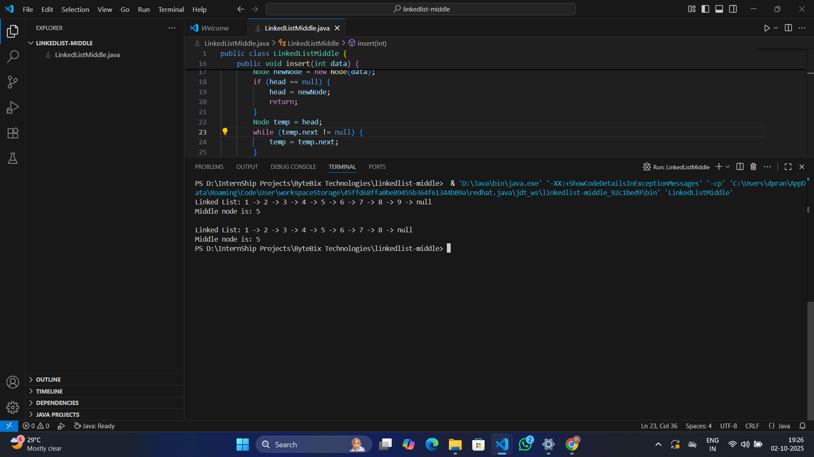

# Linked List - Find Middle Node (Two-Pass Method)

This project implements a **singly linked list** in Java with:
- Insertion of nodes at the end
- Finding the **middle node** using the **two-pass method**:
  1. Count the number of nodes
  2. Traverse again to reach the middle


---

## 🖼 Screenshot of Program output:-
<p align="center">
  
</p>

---


## ▶️ How to Run

1. Clone this repository:
   ```bash
   git clone https://github.com/daspranay918/linkedlist-middle.git
   cd linkedlist-middle
